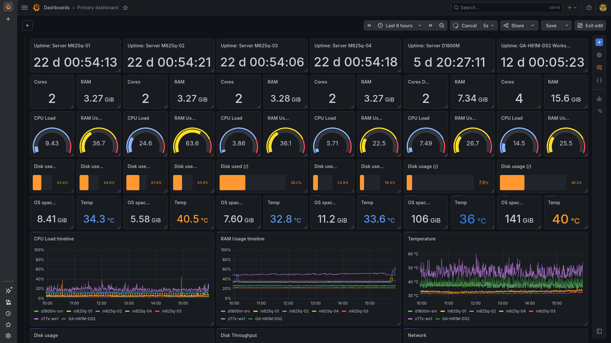
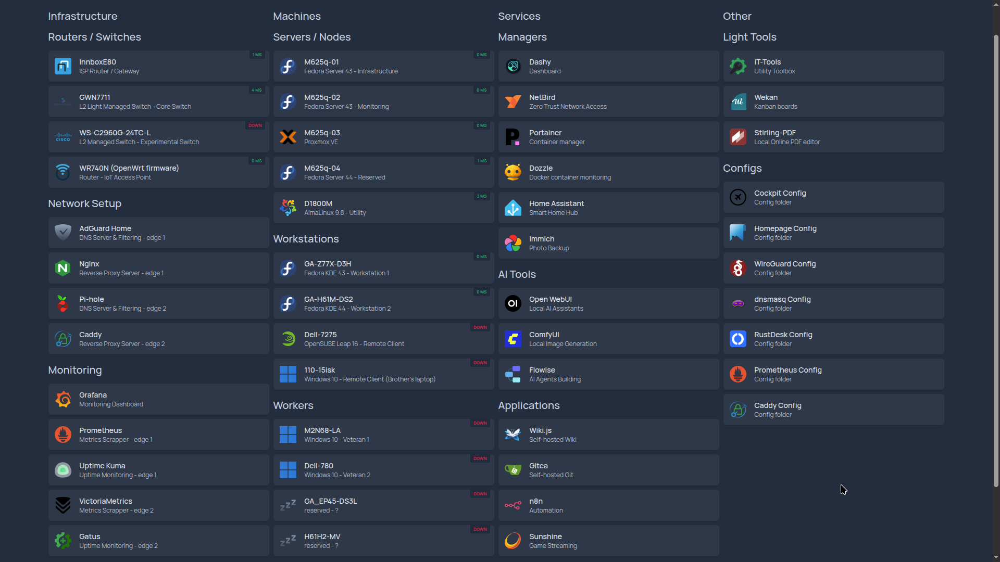
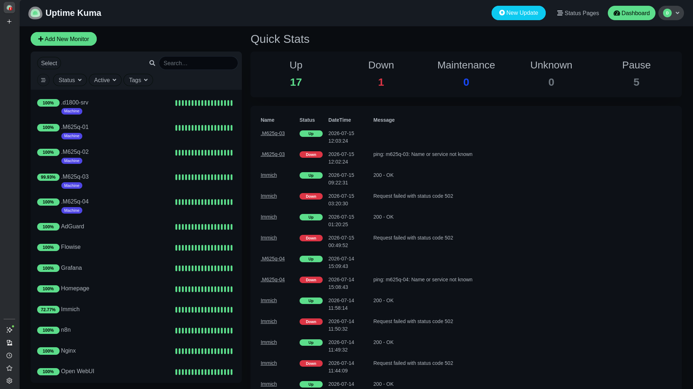
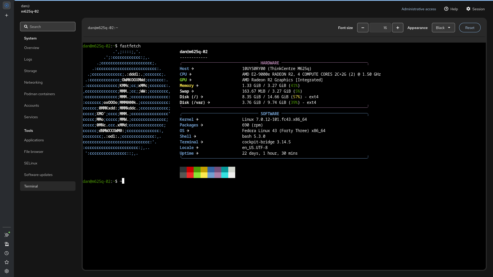
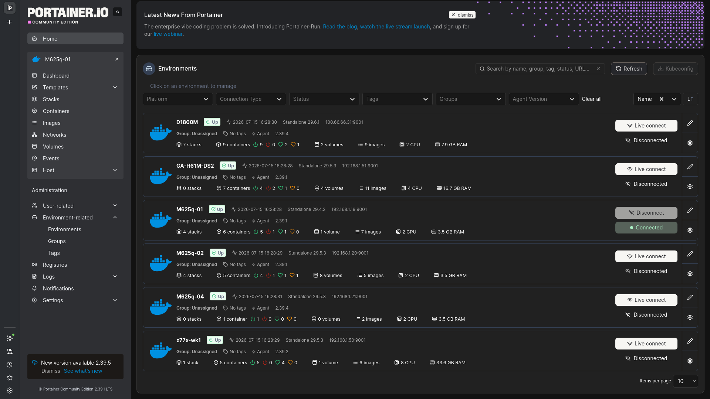

# Dan0MD

Linux • Infrastructure • Self-hosting • Hardware • Experimental Computing • DIY Engineering

Fedora Linux user since 2024 | Android user since 2018 | Windows user since 2014 | Feature phone user since 2011 😄

---

Fedora Workstation / KDE / Server • AlmaLinux • OpenSUSE Leap / Tumbleweed • Proxmox VE • Windows deployment & maintenance

---

<table>
<tr>
<td width="220"><strong>Platforms</strong></td>
<td width="790">

&nbsp;&nbsp;&nbsp;&nbsp;&nbsp;&nbsp;&nbsp;&nbsp;&nbsp;&nbsp;&nbsp;&nbsp;&nbsp;&nbsp;&nbsp;&nbsp;&nbsp;&nbsp;&nbsp;&nbsp;&nbsp;&nbsp;&nbsp;&nbsp;&nbsp;&nbsp;

<!--  -->

</td>
</tr>
  
<tr>
<td><strong>Languages / Frameworks</strong></td>
<td>

<table>
<tr>
<td width="250" align="center">
<strong>Mainstack</strong> 

<!--  -->

</td>

<td width="24"></td>

<td align="center">
<strong>Embedded</strong> 
<!--  -->

<!--  -->
</td>

<td width="24"></td>

<td align="center">
<strong>Origins</strong> 

<!--  -->

</td>

<td width="24"></td>

<td width="210" align="center">
<strong>Scripting</strong> 

</td>
</tr>
</table>

</td>
</tr>

<tr>
<td><strong>Infrastructure</strong></td>
<td>

<!--  -->

<!--  -->
<!--  -->
</td>
</tr>

<tr>
<td><strong>Control Plane</strong></td>
<td>

</td>
</tr>

<tr>
<td><strong>Services</strong></td>
<td>

</td>
</tr>

<tr>
<td><strong>Local LLM / AI</strong></td>
<td>
<!--  -->

</td>
</tr>

<tr>
<td><strong>Dev / Tooling</strong></td>
<td>
<!--  -->

&nbsp;&nbsp;&nbsp;&nbsp;&nbsp;&nbsp;&nbsp;&nbsp;&nbsp;&nbsp;&nbsp;&nbsp;&nbsp;&nbsp;&nbsp;&nbsp;

<!--  -->

</td>
</tr>
</table>

<h3>🛠️ Personal HomeLab Ecosystem</h3>

Personal infrastructure project focused on Linux administration, networking, monitoring, automation, and self-hosted services.

<!--  -->

<!-- 2. NETWORK ARCHITECTURE & DEPLOYMENT MAP DROP-DOWN -->

  
🌐 <strong>View Network Architecture & Node Placement</strong>

<!--  -->

<table width="850px">
  <!-- LAB 1: INFRASTRUCTURE CORES -->
  <tr>
    <td width="200px" style="width: 200px;"><strong>🏢 Lab 1: Infrastructure & Control</strong></td>
    <td>
      <ul>
        <li><strong>M625q-01 (Edge Gateway):</strong> Fedora Server | AdGuard Home, NPM, Homepage, WireGuard</li>
        <li><strong>M625q-02 (Monitoring):</strong> Fedora Server | Prometheus, Grafana, Uptime Kuma, NetDisco</li>
        <li><strong>M625q-03 (Auxiliary Worker):</strong> Fedora Server | Bare-metal Docker node</li>
        <li><strong>M625q-04 (Auxiliary Worker):</strong> Fedora Server | Bare-metal Docker node</li>
        <li><strong>Dell-7275 (Mobile Control Plane):</strong> OpenSUSE Leap | Moonlight remote viewer diagnostics</li>
        <li><strong>GA-Z77X-D3H (Workstation 1):</strong> Fedora KDE | IDE/CAD, Local AI, Immich Host, Linux Gaming</i>
        <li><strong>GA-H61M-DS2 (Workstation 2):</strong> Fedora KDE (Headless) | CI/CD, n8n, Gitea, Flowise, Sunshine</i>
      </ul>
    </td>
  </tr>

  <!-- LAB 2: REMOTE EDGES -->
  <tr>
    <td width="200px" style="width: 200px;"><strong>🏡 Lab 2: Remote & Staging Nodes</strong></td>
    <td>
      <ul>
        <li><strong>D1800M (Remote Gateway):</strong> AlmaLinux | Pi-hole, Caddy, Gatus, Dashy, HomeAssistant</li>
        <li><strong>Dell-780 (Monitoring):</strong> AlmaLinux | VictoriaMetrics & NetDisco <i>(To be deployed)</i></li>
        <li><strong>GA-EP45-DS3L (Storage):</strong> AlmaLinux | Kopia Backup Engine & Nextcloud <i>(Wake-on-LAN)</i></li>
        <li><strong>H61H2-MV (Sandbox Environment):</strong> Arch Linux | Bleeding-edge Docker experiment node</li>
        <li><strong>110-15isk (Remote Client):</strong> Windows 10 (future CachyOS) | Brother's workstation & gaming</li>
        <li><strong>M2N68-LA (Nostalgia Rig):</strong> Windows 7 | Dedicated LAN box for legacy titles (CSS, Stronghold, GTA)</li>
      </ul>
    </td>
  </tr>

</table>

  
💻 <strong>View Full Hardware Stack & Specifications</strong>

   
  <!-- RESOURCE METRICS DASHBOARD -->
  <blockquote>
    📊 <strong>Operational Fleet Summary (🟢 Active Nodes)</strong>
    <ul>
      <li><strong>Total Cores/Threads:</strong> <code>32C/40T</code></li>
      <li><strong>Total Compute Memory:</strong> <code>115 GB RAM</code></li>
      <li><strong>Total Storage Pool:</strong> <code>6.65 TB</code> (6808 GB across SSD, HDD, NVMe, Flash, and SD media)</li>
      <li><strong>Node Count:</strong> 9 Online Nodes (4x Clusters, 2x Hybrid Workstations, 2x Mobile Clients, 1x Edge Gateway)</li>
    </ul>
  </blockquote>
  
**Hardware stack:** 

- 🟢 4x Lenovo ThinkCentre M625q + AMD E2-9000e + 4GB RAM + 32GB SSD
- 🟢 1x Gigabyte GA-H61M-DS2 + i5-3470 + GT 1030 2GB + 16GB RAM + 240GB SSD
- 🟢 1x Gigabyte GA-Z77X-D3H + i7-3770 + GTX 1070 Ti 8GB + 32GB RAM + 2x240GB SSD + 1TB NVMe + 3x1TB 2.5" HDD
- 🟢 1x Dell Latitude 12 7275 + m7-6Y75 + HD 515 + 8GB RAM + 128GB SSD + 64GB SD card
- 🟢 1x ASRock D1800M + J1800 + 8GB RAM + 128GB SSD
- 🟢 1x Lenovo Ideapad 110-15isk + Pentium 4405U + Radeon R5 M330 + 12GB RAM + 120GB SSD + 240GB SSD
- ⚪ 1x ECS EliteGroup H61H2-MV + i3-2120 + GT 710 2GB + 8GB RAM + 120GB SSD *(to be deployed)*
- ⚪ 1x Dell Optiplex 780 SFF + E7500 + GT 710 2GB + 7GB RAM + 120GB SSD *(to be deployed)*
- ⚪ 1x Gigabyte GA-EP45-DS3L + Q8200 + GT 710 2GB + 8GB RAM + 120GB SSD *(to be deployed)*
- 🔵 1x M2N68-LA + Athlon 64 X2 4000+ + GeForce 6150SE + 2GB RAM + 80GB HDD *(Retro Machine)*
  

<!-- 1. KEY TECHNOLOGIES DROP-DOWN -->

  
🧰 <strong>View Key Technologies & Core Tech Stack</strong>

   
  
**Key technologies:**
- Linux Fedora Server | Linux Fedora KDE Plasma Desktop | AlmaLinux | OpenSUSE Leap
- WireGuard VPN | AdGuard DNS | Nginx Reverse Proxy
- RustDesk | Sunshine | Moonlight
- Prometheus | Grafana | Uptime Kuma | Homepage
- Gitea | Wiki.js | Wekan
- Ollama | llama.cpp | OpenWebUI | Flowise
- Stability Matrix | ComfyUI | 
- Custom ASP.NET Blazor app for Remote Management
  

<!-- 3. FUTURE PLACEHOLDER FOR DIAGRAMS -->
<!-- 

  
📊 <strong>View Infrastructure Diagrams (Architecture Map)</strong>

   
  

    <!-- Când ai diagrama gata (Mermaid sau PNG), o poți introduce direct aici --
    <i>Architecture diagram placeholder. Coming soon!</i>
  

 -->

<!-- 4. EXTERNAL LINKS & WRITE-UPS -->

  
🔗 <strong>Project Write-ups & Community Threads</strong>

   
  <ul>
    <li>
      <a href="https://www.reddit.com/r/homelab/comments/1srplwo/built_a_homelab_from_lowpower_and_mostly/" target="_blank">
        💬 Reddit: HomeLab project v1 – Detailed Community Discussion & Architecture Notes
      </a>
    </li>
  </ul>

  
<strong>Lab Screenshots (click to open)

  
  
  
  
  

<!-- -->
